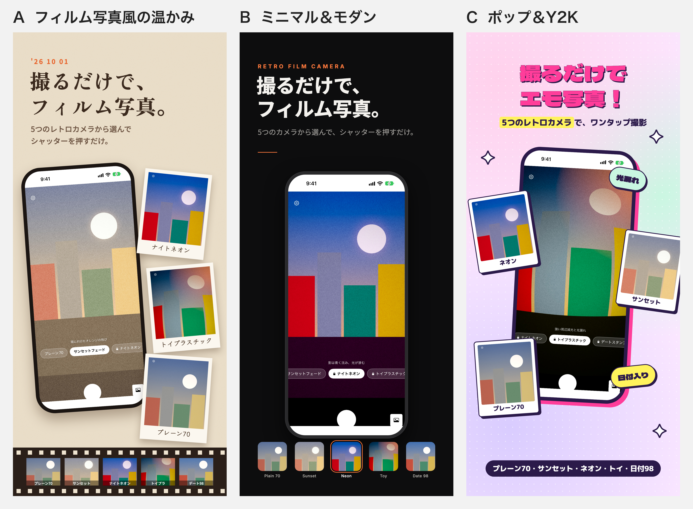

# RetroSnap ASO 改善調査（2026-10-01）

対象: レトロフォト / RetroSnap / App ID `6468934085` / 配信中 0.3.0（買い切り課金3本承認済み）

調査方法:
- 現行メタデータとスクリーンショット: App Store Connect API（読み取りのみ。`appInfoLocalizations` / `appStoreVersionLocalizations` / `appScreenshotSets`）
- 競合の順位と評価件数: iTunes Search API（`https://itunes.apple.com/search?country=jp|us&entity=software&limit=200`）。App Store の実際の検索結果
- 競合のサブタイトル: `apps.apple.com/<国>/app/id<ID>` の HTML から取得（38本）
- 検索需要のシグナル: Apple 検索オートコンプリート（`MZSearchHints`。日本 143462、米国 143441）
- アプリの実機能: `RetroSnap/Camera/CameraCatalog.swift` と `Localizable.xcstrings`（書いてある機能が実在するかをコードで確認）

★ ASC へのアップロードはしていない。この文書は案。

---

## 1. 現状の棚卸し

### 1-1. 実数値（直近14日、タスク指示より）

| インプレッション | ページ閲覧 | DL | imp→ページ閲覧 | ページ閲覧→DL |
|---|---|---|---|---|
| 1,060 | 37 | 2 | **3.5%** | **5.4%** |

- 読み上げナレーター（2026-07）は imp→ページ閲覧 3.8%、ページ閲覧→DL 約16%。**RetroSnap はページに来た人の転換が3分の1しかない**。
  一番の原因はスクショ（§1-3）。課金の入った 0.3.0 の中身が、ストアのページにまったく出ていない。
- インプレッションも小さい（約76/日）。主要語で圏外が多く、キーワードの網羅が足りない（§2）。

### 1-2. 現行メタデータ

| 項目 | ja | 文字数 | en-US | 文字数 |
|---|---|---|---|---|
| 名前 | `レトロフォト - クラシック撮影` | 16/30 | `RetroSnap - Old-Time Camera` | 27/30 |
| サブタイトル | `だれでも簡単に使えるレトロカメラ、ビンテージスナップ。` | 27/30 | `Capture the Past in a Camera!` | 29/30 |
| キーワード | `カメラ,セピア,レトロ,写真,フィルム,モノクロ,旧式,エフェクト,ヴィンテージ,ノスタルジック,スナップショット,ポラロイド,一眼レフ,デジタル変換,クラシック,写真加工,フォトエディター,メモリー` | 100/100 | `Camera,Sepia,Retro,Photo,Film,Monochrome,Old,Effect,Vintage,Nostalgic,Snapshot,Polaroid,Classic,` | 96/100 |
| プロモーションテキスト | なし | 0 | なし | 0 |
| カテゴリ | 写真/ビデオ | — | 同左 | — |

構造的な問題:

- **ストアの名前が「レトロフォト」、ホーム画面の名前が「レトロカメラ」**（`InfoPlist.xcstrings` の `CFBundleDisplayName`）。説明文の中では「レトロカメラは〜」と書いている。検索で拾ってくれた人に、名前が3通りに見えている。
  しかも需要がある語は「レトロカメラ」のほうで（`レトロ` の候補3番目、`レトロカメラ無料` も候補）、「レトロフォト」は候補に出ない。自社名で2位を取っても流入が無い。
- **説明文が 0.3.0 の中身と食い違う**。「シャッターを押すだけで、自動でヴィンテージ風の色合いに（調整は不要）」としか書いておらず、カメラ5台の切り替えにも課金にも触れていない。en-US も同じ。
- **キーワードに実在しない機能や、効かない語が入っている**:
  - `モノクロ` `一眼レフ` `デジタル変換` `写真加工` `フォトエディター`: アプリにモノクロのカメラは無く、既存の写真を読み込んで加工する機能も無い（撮影専用）。説明と食い違う語は審査リスク（2.3.7）があるうえ、`写真加工` は上位10本の評価件数の中央値が17万件で、勝てない
  - `ポラロイド` / `Polaroid`: **他社の商標**。キーワードへの商標の使用は 2.3.7 違反になりうる。外すべき
  - `カメラ` `写真` `レトロ`（ja）: 名前とサブタイトルにすでに入っている語との重複
  - en-US の末尾のカンマは無駄な1文字
- **プロモーションテキストが空**。ここは審査なしで即時に変えられる唯一の枠。

### 1-3. 現行スクリーンショット（ASC 上のもの）

| ロケール | サイズ | 枚数 | 中身 |
|---|---|---|---|
| ja | 6.7"（1290×2796） | 3 | `1タップで簡単撮影`（セピアの1枚）/ `写真を撮るだけであの頃に戻ろう`（ギャラリー、黒い空サムネ入り）/ `撮影した写真をSNSでシェア`（iOS 標準の共有シート） |
| en-US | 5.5" / 6.5" | 3 | ja と同じ絵で、文字だけ英語。**画面の UI は日本語のまま** |

- 0.3.0 の売り（カメラ5台・ナイトネオン・光漏れ・日付の焼き込み）が1枚も出ていない。見えるのはセピアの1色だけ
- 2枚目は空っぽのギャラリー、3枚目は iOS 標準の共有シートで、このアプリならではの要素が無い
- 8月に作った5枚の版下（`fastlane/screenshots/ja/`）は **ASC にアップロードされていない**
- 作り直しは §6 で別に進めている

---

## 2. 競合調査（2026-10-01 時点）

### 2-1. キーワード別の上位10本（iTunes Search API / 2026-10-01）

#### JP「レトロカメラ」 — RetroSnap: **106位**（184件中）

| # | アプリ | サブタイトル | 評価件数 | ★ |
|---|---|---|---|---|
| 1 | Dazz - フィルムカメラ | 人気のカメラアプリ & 動画写真加工 | 79,224 | 4.76 |
| 2 | 1998 Cam - レトロフィルムカメラ | 写真＆動画フィルター・エモい加工アプリ | 13,472 | 4.58 |
| 3 | Huji Cam | まるで1998年のように | 3,236 | 4.13 |
| 4 | OldRoll - レトロフィルムカメラ | 人気のカメラアプリ & インスタント写真風加工 | 2,486 | 4.65 |
| 5 | Pixie+（ピクシー）｜Y2K デジカメ風カメラ | Y2K デジカメ風カメラ＆フィルター | 1,775 | 4.47 |
| 6 | Fomz - フィルムカメラアプリ | 人気のカメラアプリ·写真加工·動画·チェキ風 | 1,431 | 4.65 |
| 7 | あのカメラ - エモいレトロカメラ | — | 40 | 4.85 |
| 8 | ProCCD - フィルムカメラVintage Camera | — | 516 | 4.69 |
| 9 | Rarevision VHS Lite: Retro Cam | — | 849 | 4.51 |
| 10 | レトロカメラPRO | — | 1,910 | 4.25 |

#### JP「フィルムカメラ」 — RetroSnap: **圏外**（181件中）

| # | アプリ | サブタイトル | 評価件数 | ★ |
|---|---|---|---|---|
| 1 | Dazz - フィルムカメラ | 人気のカメラアプリ & 動画写真加工 | 79,224 | 4.76 |
| 2 | 1998 Cam - レトロフィルムカメラ | 写真＆動画フィルター・エモい加工アプリ | 13,472 | 4.58 |
| 3 | Huji Cam | まるで1998年のように | 3,236 | 4.13 |
| 4 | Fomz - フィルムカメラアプリ | 人気のカメラアプリ·写真加工·動画·チェキ風 | 1,431 | 4.65 |
| 5 | OldRoll - レトロフィルムカメラ | 人気のカメラアプリ & インスタント写真風加工 | 2,486 | 4.65 |
| 6 | EE35 フィルムカメラ | — | 994 | 3.84 |
| 7 | 101cam - フィルム&デジタルカメラ | — | 35 | 4.66 |
| 8 | Kadaカメラ - フィルムカメラ | — | 4,253 | 4.46 |
| 9 | NOMO CAM - ポイント & シュート | ミニマリストのアナログカメラ | 58,636 | 4.63 |
| 10 | ProCCD - フィルムカメラVintage Camera | — | 516 | 4.69 |

#### JP「写ルンです」 — RetroSnap: **圏外**（117件中）

| # | アプリ | サブタイトル | 評価件数 | ★ |
|---|---|---|---|---|
| 1 | 写ルンです＋ | 富士フイルム公式　画像データ受け取りアプリ | 253 | 4.64 |
| 2 | Huji Cam | まるで1998年のように | 3,236 | 4.13 |
| 3 | Dazz - フィルムカメラ | 人気のカメラアプリ & 動画写真加工 | 79,224 | 4.76 |
| 4 | 1998 Cam - レトロフィルムカメラ | 写真＆動画フィルター・エモい加工アプリ | 13,472 | 4.58 |
| 5 | OldRoll - レトロフィルムカメラ | 人気のカメラアプリ & インスタント写真風加工 | 2,486 | 4.65 |
| 6 | 2000s Y2K デジカメ・レトロカメラ | — | 1 | 5 |
| 7 | EE35 フィルムカメラ | — | 994 | 3.84 |
| 8 | NOMO CAM - ポイント & シュート | ミニマリストのアナログカメラ | 58,636 | 4.63 |
| 9 | RetroShot-フィルムカメラ加工エモい写ルンです風 | — | 103 | 4.84 |
| 10 | Luzmo - 35mm Film Pro Cam CCD | — | 114 | 4.43 |

#### JP「エモい 写真」 — RetroSnap: **圏外**（186件中）

| # | アプリ | サブタイトル | 評価件数 | ★ |
|---|---|---|---|---|
| 1 | 1998 Cam - レトロフィルムカメラ | 写真＆動画フィルター・エモい加工アプリ | 13,472 | 4.58 |
| 2 | Dazz - フィルムカメラ | 人気のカメラアプリ & 動画写真加工 | 79,224 | 4.76 |
| 3 | Prequel: 写真フィルター リール編集 動画加工 | レトロ フィルム、チェキ風 & トイ カメラ エディタ | 17,614 | 4.63 |
| 4 | Phonto 写真文字入れ | 写真 & タイポグラフィー | 135,423 | 4.73 |
| 5 | 蔵衛門工事黒板 - 工事写真台帳のための電子小黒板アプリ | 国交省NETIS掲載・デジカメと比べて作業時間を1/4に短縮 | 20,430 | 4.71 |
| 6 | AI Cleaner: ストレージ最適化＆写真クリーナー | — | 11,330 | 4.19 |
| 7 | TOK CAM - チェキ風レトロフィルムカメラ | — | 433 | 4.67 |
| 8 | 1967：レトロなフィルタとエフェクト | — | 1,454 | 4.45 |
| 9 | OldRoll - レトロフィルムカメラ | 人気のカメラアプリ & インスタント写真風加工 | 2,486 | 4.65 |
| 10 | かんたん日記帳!人気のかわいいカレンダー日記アプリ | — | 6,050 | 4.42 |

#### JP「日付 カメラ」 — RetroSnap: **圏外**（179件中）

| # | アプリ | サブタイトル | 評価件数 | ★ |
|---|---|---|---|---|
| 1 | DateCam | 日付をつけて撮影できるカメラ | 372 | 4.16 |
| 2 | タイムスタンプカメラ - 写真に日付を焼き込み | 現場写真・作業記録の日付入れに | 0 | 0 |
| 3 | Timestamp Camera Basic | Best add date, GPS to video | 641 | 4.47 |
| 4 | 日付カメラ - Stampry | 写真に日付・時刻・場所を追加 | 2 | 5 |
| 5 | タイムスタンプカメラ - 日付・住所入り現場写真 | 撮った瞬間に日付・GPS・住所が証拠として残る | 10 | 4.1 |
| 6 | タイムスタンプカメラ - 写真日付記録 | — | 3,967 | 4.42 |
| 7 | 1998 Cam - レトロフィルムカメラ | 写真＆動画フィルター・エモい加工アプリ | 13,472 | 4.58 |
| 8 | タイムスタンプ・日付カメラ - 時間入り写真を撮影・画像加工 | — | 11 | 4 |
| 9 | シンプルカメラ | — | 49,251 | 4.57 |
| 10 | 申請カメラくん | — | 0 | 0 |

#### JP「フィルター」 — RetroSnap: **圏外**（166件中）

| # | アプリ | サブタイトル | 評価件数 | ★ |
|---|---|---|---|---|
| 1 | Dazz - フィルムカメラ | 人気のカメラアプリ & 動画写真加工 | 79,224 | 4.76 |
| 2 | わたあめカメラ ふんわり＆ぼかし加工アプリ | 動画編集、モザイク、写真加工が簡単にできるアプリ | 73,134 | 4.78 |
| 3 | Foodie(フーディー)-料理がおいしく撮れるカメラ | 料理フィルター/フィルム/画像加工 | 80,129 | 4.53 |
| 4 | VSCO：画像と動画の加工アプリ | 写真フィルターとプリセット | 27,536 | 4.52 |
| 5 | Prequel: 写真フィルター リール編集 動画加工 | レトロ フィルム、チェキ風 & トイ カメラ エディタ | 17,614 | 4.63 |
| 6 | SNOW スノー - AIプロフィール | — | 361,054 | 4.48 |
| 7 | BeautyPlus-写真加工、証明写真、自撮りカメラ | — | 384,591 | 4.67 |
| 8 | 1998 Cam - レトロフィルムカメラ | 写真＆動画フィルター・エモい加工アプリ | 13,472 | 4.58 |
| 9 | B612 - 日常をもっとおしゃれにするカメラ | — | 64,051 | 4.39 |
| 10 | Ulikeユーライク：ナチュラルに盛るビューティカメラ！ | — | 139,189 | 4.64 |

#### JP「オールドカメラ」 — RetroSnap: **27位**（167件中）

| # | アプリ | サブタイトル | 評価件数 | ★ |
|---|---|---|---|---|
| 1 | OldRoll - レトロフィルムカメラ | 人気のカメラアプリ & インスタント写真風加工 | 2,486 | 4.65 |
| 2 | Dazz - フィルムカメラ | 人気のカメラアプリ & 動画写真加工 | 79,224 | 4.76 |
| 3 | 1998 Cam - レトロフィルムカメラ | 写真＆動画フィルター・エモい加工アプリ | 13,472 | 4.58 |
| 4 | Fomz - フィルムカメラアプリ | 人気のカメラアプリ·写真加工·動画·チェキ風 | 1,431 | 4.65 |
| 5 | NOMO CAM - ポイント & シュート | ミニマリストのアナログカメラ | 58,636 | 4.63 |
| 6 | Kadaカメラ - フィルムカメラ | — | 4,253 | 4.46 |
| 7 | カメラ | — | 3,112 | 3.42 |
| 8 | オルディ Oldi - Phone Camera | — | 19 | 4.58 |
| 9 | Huji Cam | まるで1998年のように | 3,236 | 4.13 |
| 10 | ビンテージフィルムカメラ - レトロ映画風ビデオカメラ | — | 1,256 | 4.5 |

#### JP「レトロ」 — RetroSnap: **35位**（175件中）

| # | アプリ | サブタイトル | 評価件数 | ★ |
|---|---|---|---|---|
| 1 | Retro — 友達と写真を共有 | 思い出、アルバム、振り返り | 13,379 | 4.68 |
| 2 | Dazz - フィルムカメラ | 人気のカメラアプリ & 動画写真加工 | 79,224 | 4.76 |
| 3 | 1998 Cam - レトロフィルムカメラ | 写真＆動画フィルター・エモい加工アプリ | 13,472 | 4.58 |
| 4 | OldRoll - レトロフィルムカメラ | 人気のカメラアプリ & インスタント写真風加工 | 2,486 | 4.65 |
| 5 | EPIK エピック - AI写真＆動画編集 | フィルター, エフェクト, レタッチ, メイク, AI... | 92,344 | 4.73 |
| 6 | BeautyPlus-写真加工、証明写真、自撮りカメラ | — | 384,591 | 4.67 |
| 7 | Rollie: フィルムカメラ・レトロ加工 | — | 4 | 4.75 |
| 8 | Dan The Man | — | 3,106 | 4.69 |
| 9 | LOOTFALL: 放置系レトロRPG | — | 61 | 4.66 |
| 10 | FOMO Cam - レトロなフィルムカメラ | — | 0 | 0 |

#### JP「使い捨てカメラ」 — RetroSnap: **圏外**（188件中）

| # | アプリ | サブタイトル | 評価件数 | ★ |
|---|---|---|---|---|
| 1 | Huji Cam | まるで1998年のように | 3,236 | 4.13 |
| 2 | Dazz - フィルムカメラ | 人気のカメラアプリ & 動画写真加工 | 79,224 | 4.76 |
| 3 | 1998 Cam - レトロフィルムカメラ | 写真＆動画フィルター・エモい加工アプリ | 13,472 | 4.58 |
| 4 | Scene: 結婚式 使い捨てカメラ | QRで繋がる結婚式・パーティーカメラ | 33 | 4.33 |
| 5 | cheesy - みんなで撮るフィルムカメラ | 撮った27枚を、あとで一緒に見返す思い出アルバム | 5 | 5 |
| 6 | ディスポ - 使い捨てカメラでレトロな瞬間を切り取ろう！ | — | 92 | 4.62 |
| 7 | OldRoll - レトロフィルムカメラ | 人気のカメラアプリ & インスタント写真風加工 | 2,486 | 4.65 |
| 8 | FilmShot | — | 0 | 0 |
| 9 | フィルムカメラ - ふぃるむかめら 写真加工 | — | 554 | 4.71 |
| 10 | Konfetti - 使い捨てカメラ | — | 0 | 0 |

#### JP「トイカメラ」 — RetroSnap: **圏外**（129件中）

| # | アプリ | サブタイトル | 評価件数 | ★ |
|---|---|---|---|---|
| 1 | 1998 Cam - レトロフィルムカメラ | 写真＆動画フィルター・エモい加工アプリ | 13,472 | 4.58 |
| 2 | TinyDoor：ミニチュア風加工カメラ | 写真も動画もジオラマ風に編集 | 0 | 0 |
| 3 | Dazz - フィルムカメラ | 人気のカメラアプリ & 動画写真加工 | 79,224 | 4.76 |
| 4 | Huji Cam | まるで1998年のように | 3,236 | 4.13 |
| 5 | minista | 写真をミニチュアにできるカメラアプリ | 6 | 2.83 |
| 6 | トイデジ - レトロなデジカメ写真 | — | 1 | 5 |
| 7 | ToyCam! | — | 1 | 5 |
| 8 | AR TOY トイカメラ | — | 133 | 3.62 |
| 9 | ToyEye Lite | — | 14 | 1.86 |
| 10 | film12 | — | 129 | 3.57 |

#### US「retro camera」 — RetroSnap: **70位**（188件中）

| # | アプリ | サブタイトル | 評価件数 | ★ |
|---|---|---|---|---|
| 1 | Dazz Cam - Vintage Camera | Photo filters & Video effects | 115,100 | 4.75 |
| 2 | Huji Cam | Just Like The Year 1998 | 11,961 | 4.22 |
| 3 | 1998 Cam - Vintage Camera | Photo & Video Film Filters | 40,260 | 4.8 |
| 4 | Rarevision VHS Lite: Retro Cam | U can't not love our VHS look! | 7,846 | 4.66 |
| 5 | OldRoll - Vintage Film Camera | Disposable Cam & Retro Filters | 5,591 | 4.71 |
| 6 | Lapse - Disposable Camera | For capturing real life | 118,285 | 4.75 |
| 7 | True VHS - 90s Vintage camera | — | 3,421 | 4.41 |
| 8 | DAZE CAM - Vintage Camera | — | 11,959 | 4.75 |
| 9 | 0.3MP Camera | — | 9,776 | 4.84 |
| 10 | VHS Cam - Retro Camcorder FX | — | 10,556 | 4.38 |

#### US「film camera」 — RetroSnap: **圏外**（188件中）

| # | アプリ | サブタイトル | 評価件数 | ★ |
|---|---|---|---|---|
| 1 | Dazz Cam - Vintage Camera | Photo filters & Video effects | 115,100 | 4.75 |
| 2 | Huji Cam | Just Like The Year 1998 | 11,961 | 4.22 |
| 3 | OldRoll - Vintage Film Camera | Disposable Cam & Retro Filters | 5,591 | 4.71 |
| 4 | 1998 Cam - Vintage Camera | Photo & Video Film Filters | 40,260 | 4.8 |
| 5 | Lapse - Disposable Camera | For capturing real life | 118,285 | 4.75 |
| 6 | DAZE CAM - Vintage Camera | — | 11,959 | 4.75 |
| 7 | Kada Cam - Vintage Camera | — | 1,771 | 4.68 |
| 8 | NOMO CAM - Point and Shoot | — | 48,178 | 4.66 |
| 9 | Tezza: Aesthetic Photo Editor | — | 47,328 | 4.74 |
| 10 | Film Cam - Vintage Roll Camera | — | 596 | 4.47 |

#### US「disposable camera」 — RetroSnap: **圏外**（180件中）

| # | アプリ | サブタイトル | 評価件数 | ★ |
|---|---|---|---|---|
| 1 | Dispo: Retro Disposable Camera | Vintage Camera & Photo Editing | 8,165 | 4.29 |
| 2 | Huji Cam | Just Like The Year 1998 | 11,961 | 4.22 |
| 3 | Lapse - Disposable Camera | For capturing real life | 118,285 | 4.75 |
| 4 | Dazz Cam - Vintage Camera | Photo filters & Video effects | 115,100 | 4.75 |
| 5 | POV – Disposable Camera Events | Guest photos: wedding & party | 15,099 | 4.91 |
| 6 | OldRoll - Vintage Film Camera | Disposable Cam & Retro Filters | 5,591 | 4.71 |
| 7 | 1998 Cam - Vintage Camera | Photo & Video Film Filters | 40,260 | 4.8 |
| 8 | Once - Disposable Camera Event | — | 629 | 4.75 |
| 9 | DAZE CAM - Vintage Camera | — | 11,959 | 4.75 |
| 10 | radcam: digital camera | — | 39,238 | 4.49 |

#### US「date stamp camera」 — RetroSnap: **圏外**（191件中）

| # | アプリ | サブタイトル | 評価件数 | ★ |
|---|---|---|---|---|
| 1 | Timestamp Camera Basic | Best add date, GPS to video | 33,646 | 4.75 |
| 2 | DateStamper | The modern photo stamper | 9,231 | 4.82 |
| 3 | Date Stamp Camera - DateStamp | Add Date & Time to Photo Video | 0 | 0 |
| 4 | Stamp Camera Date and Location | Capture and Mark Moments | 0 | 0 |
| 5 | StampCam - Date Stamp Camera | Date stamp camera for photos | 0 | 0 |
| 6 | Date Stamper - Stampry | — | 5 | 4.6 |
| 7 | Timestamp It - Proof Camera | — | 5,492 | 4.67 |
| 8 | Timestamp Camera: Photo GPS | — | 6,513 | 4.67 |
| 9 | Timestamp Camera: Date Stamper | — | 611 | 4.67 |
| 10 | GPS Map Camera: Geo Photos | — | 7,891 | 4.62 |

### 2-2. キーワード別の強さ一覧（上位10本の評価件数）

| KW | RetroSnap順位 | 上位10の評価件数(中央値) | 評価1,000件未満の本数 | 1位 |
|---|---|---|---|---|
| JP レトロカメラ | 106位 | 1,842 | 3/10 | Dazz - フィルムカメラ（79,224） |
| JP フィルムカメラ | 圏外 | 2,861 | 3/10 | Dazz - フィルムカメラ（79,224） |
| JP 写ルンです | 圏外 | 1,740 | 5/10 | 写ルンです＋（253） |
| JP エモい 写真 | 圏外 | 12,401 | 1/10 | 1998 Cam - レトロフィルムカメラ（13,472） |
| JP 日付 カメラ | 圏外 | 191 | 7/10 | DateCam（372） |
| JP フィルター | 圏外 | 76,179 | 0/10 | Dazz - フィルムカメラ（79,224） |
| JP レトロ | 35位 | 8,242 | 3/10 | Retro — 友達と写真を共有（13,379） |
| JP フィルムカメラ アプリ | 圏外 | 6,108 | 1/10 | Dazz - フィルムカメラ（79,224） |
| JP カメラ | 圏外 | 79,676 | 0/10 | BeautyPlus-写真加工、証明写真、自撮り（384,591） |
| JP エモい | 圏外 | 8,354 | 1/10 | Dazz - フィルムカメラ（79,224） |
| JP 日付入り | 圏外 | 2 | 8/10 | タイムスタンプ・日付カメラ - 時間入り写真を撮（11） |
| JP インスタントカメラ | 圏外 | 533 | 6/10 | Huji Cam（3,236） |
| JP チェキ | 圏外 | 3,172 | 3/10 | instax UP! -富士フイルム公式チェキス（4,301） |
| JP 平成 カメラ | 圏外 | 3 | 10/10 | 平成カメラ（10） |
| JP トイカメラ | 圏外 | 71 | 7/10 | 1998 Cam - レトロフィルムカメラ（13,472） |
| JP ネオン | 圏外 | 411 | 6/10 | LEDバナープロ - 電光掲示板（16,659） |
| JP ヴィンテージ | 圏外 | 709 | 6/10 | VINTY - 古着ファッションアプリ（134） |
| JP オールドカメラ | 27位 | 3,174 | 1/10 | OldRoll - レトロフィルムカメラ（2,486） |
| JP セピア | 71位 | 11 | 7/10 | SEPIA（0） |
| JP デジカメ | 圏外 | 1,603 | 4/10 | Dazz - フィルムカメラ（79,224） |
| JP 使い捨てカメラ | 圏外 | 323 | 6/10 | Huji Cam（3,236） |
| JP フィルム風 | 圏外 | 2,861 | 2/10 | Dazz - フィルムカメラ（79,224） |
| JP レトロフォト | 2位 | 1,587 | 4/10 | Retro — 友達と写真を共有（13,379） |
| JP 写真加工 | 圏外 | 177,397 | 0/10 | BeautyPlus-写真加工、証明写真、自撮り（384,591） |
| US retro camera | 70位 | 11,257 | 0/10 | Dazz Cam - Vintage Camer（115,100） |
| US film camera | 圏外 | 26,110 | 1/10 | Dazz Cam - Vintage Camer（115,100） |
| US disposable camera | 圏外 | 13,530 | 1/10 | Dispo: Retro Disposable （8,165） |
| US vintage camera | 圏外 | 11,960 | 1/10 | Dazz Cam - Vintage Camer（115,100） |
| US date stamp camera | 圏外 | 3,051 | 5/10 | Timestamp Camera Basic（33,646） |
| US film filter | 圏外 | 30,469 | 0/10 | Tezza: Aesthetic Photo E（47,328） |
| US 90s camera | 圏外 | 8,811 | 1/10 | 1998 Cam - Vintage Camer（40,260） |
| US dazz | 圏外 | 32,934 | 0/10 | Dazz Cam - Vintage Camer（115,100） |
| US old camera | 48位 | 6,718 | 1/10 | OldRoll - Vintage Film C（5,591） |
| US polaroid | 圏外 | 18,774 | 2/10 | Polaroid（19,047） |
| US y2k camera | 圏外 | 834 | 5/10 | Y2K Camera - 2000s CCD E（1） |
| US digicam | 圏外 | 3,869 | 3/10 | Dazz Cam - Vintage Camer（115,100） |
| JP エモいカメラ | 圏外 | 973 | 5/10 | Dazz - フィルムカメラ（79,224） |
| JP レトロカメラ無料 | 134位 | 976 | 5/10 | Dazz - フィルムカメラ（79,224） |
| JP 平成カメラ | 圏外 | 3 | 10/10 | 平成カメラ（10） |
| JP デジカメ風 | 圏外 | 98 | 6/10 | Pixie+（ピクシー）｜Y2K デジカメ風カメ（1,775） |
| JP レトロ写真 | 186位 | 3,665 | 1/10 | Dazz - フィルムカメラ（79,224） |
| JP 日付カメラ | 圏外 | 10 | 8/10 | DateCam（372） |
| JP フィルムカメラ風 | 圏外 | 1,343 | 4/10 | Dazz - フィルムカメラ（79,224） |
| JP 光漏れ | 圏外 | 57 | 10/10 | 8ミリカメラ（111） |
| JP エモカメラ | 圏外 | 2,130 | 3/10 | Dazz - フィルムカメラ（79,224） |
| JP レトロフィルムカメラ | 130位 | 1,958 | 3/10 | OldRoll - レトロフィルムカメラ（2,486） |
| JP ヴィンテージカメラ | 圏外 | 1,958 | 3/10 | 1998 Cam - レトロフィルムカメラ（13,472） |
| JP カメラ 日付 | 圏外 | 506 | 6/10 | DateCam（372） |
| JP フィルム加工 | 圏外 | 3,369 | 3/10 | Dazz - フィルムカメラ（79,224） |
| JP デジカメ風カメラ | 圏外 | 98 | 6/10 | Pixie+（ピクシー）｜Y2K デジカメ風カメ（1,775） |
| JP エモい写真 | 圏外 | 2,130 | 4/10 | Dazz - フィルムカメラ（79,224） |
| US retro camera filter | 圏外 | 11,960 | 0/10 | 1998 Cam - Vintage Camer（40,260） |
| US vintage camera filter | 圏外 | 25,599 | 0/10 | 1998 Cam - Vintage Camer（40,260） |
| US disposable camera filter | 圏外 | 28,980 | 0/10 | 1998 Cam - Vintage Camer（40,260） |
| US vintage camera free | 175位 | 12,926 | 0/10 | 1998 Cam - Vintage Camer（40,260） |
| US light leak | 圏外 | 11 | 6/10 | Light Leak Cam - Retro F（1） |
| US neon camera | 圏外 | 23 | 7/10 | Neon Camera（33） |

### 2-3. 検索需要シグナル（Apple 検索オートコンプリート MZSearchHints 実測）

候補の並び＝Appleが需要順に出す候補。候補に出る＝実際に打たれている語。

| 入力 | 候補（上から順） |
|---|---|
| JP `レトロ` | レトロ / レトロゲーム / レトロカメラ / レトロアーチ / レトロrpg / レトロゲーム 無料 / レトロガール / レトロ写真 / レトロカメラ無料 / レトロフィルムカメラ |
| JP `レトロカメラ` | レトロカメラ無料 / レトロカメラ / レトロカメラ 動画 / フォームズ レトロカメラ / レトロカメラpro / レトロカメラ, 写真 & インスタグラム フィルター / レトロカメラ: 美顔セルフィー / レトロカメラy2k / レトロカメラ - unbaked / レトロカメラ・lukyo |
| JP `フィルム` | フィルマークス / フィルムカメラ / フィルム / フィルムカメラ 露出計 / フィルムワークス / フィルムカメラ 無料 / フィルムストーリー / フィルム加工 / フィルムカメラアプリ / フィルムカメラ 加工 |
| JP `フィルムカメラ` | フィルムカメラ / フィルムカメラ 無料 / フィルムカメラ 加工 / フィルムカメラアプリ / ee35 フィルムカメラ / フィルムカメラ風 / フィルムカメラ 動画 / フィルムカメラ 露出計 / glafi - フィルムカメラ / dazz - フィルムカメラ |
| JP `写ルン` | 写ルンです / 写ルンです＋ / 写ルン / 写ルンですプラス / カメラ 写ルンです |
| JP `エモ` | emot / エモいカメラ / エモい写真 / エモい / エモカメラ / エモいゲーム / エモパー / エモい動画 / エモ写真 / エモル |
| JP `エモい` | エモいカメラ / エモい写真 / エモい / エモいゲーム / エモい動画 / エモい加工 / エモい画質 / エモいカメラアプリ / エモい写真加工 / エモいフィルター |
| JP `日付` | 日付カウント / 日付 / 日付計算 / 日付カウントダウン / 日付カメラ / 日付表示 / 日付 ウィジェット / 日付アラーム / 日付カウントアプリ / 日付電卓 |
| JP `日付カメラ` | 日付カメラ / 日付カメラ - stampry |
| JP `平成` | 平成カメラ / 平成 / 平成ゲーム / 平成プリ / @平成を生きるはらだん: reframe:multi angle recorder / 平成建設入居者アプリ / 平成写真 / 平成建設 / 平成プリクラ / 平成メモリアルダンス |
| JP `トイカメラ` | トイカメラ / ar toy トイカメラ / toyrcam トイカメラ |
| JP `使い捨て` | 使い捨てメールアドレス / 使い捨て電話番号 / 使い捨てメール / 使い捨てカメラ / 使い捨てメアド / 使い捨てsms / after24 - 使い捨てカメラ・フィルムカメラ / scene: 結婚式 使い捨てカメラ / 使い捨て携帯 / 使い捨てメール - temp-mail.io |
| JP `ネオン` | ネオン文字 / ネオン / ネオン 掲示板 / ネオンライト / ネオンペン / ネオンサイン / ネオン文字無料 / ネオンタワー / ネオンウィングス / ネオン 掲示板 無料 |
| JP `90年代` | 90年代ラジオ / rooll: 90年代フィルム＆光漏れ / インタラクティブロマンス: 90年代スタイルの愛と物語の選択 |
| JP `デジカメ` | デジカメ / デジカメ風 / デジカメ風カメラ / デジカメ転送 / デジカメ風加工 / デジカメ無料 / デジカメ写真転送 free / デジカメアプリ / デジカメ加工 / デジカメら |
| JP `オールド` | オールドロール / オールドカメラ / オールド / オールドドール / オールドローズ / オールドロー / オールドフレンズ ～ 犬のゲーム / オールド画像お楽しみ！ / オールドマン釣り - 狩猟＆時間に対する魚のレースをキャッチ / オールドミー |
| JP `ヴィンテージ` | ヴィンテージ / ヴィンテージシティ / ヴィンテージカメラ / ヴィンテージ古着 / ヴィンテージ 英語 / vinty - 古着ファッションアプリ / ヴィンテージフィルムカメラ：pixo cam / ヴィンテージの婚約指輪 - それを試着 - 不動産ダイヤモンドジュエリー / ヴィンテージフォトフレーム - フォトフレーム化のためのエディタとプロファイルを作成 / ヴィンテージフォトコラージュエディタは - フレームとステッカーであなたの写真を編集します |
| JP `セピア` | 写真加工 セピア / セピアージュ / 写真 セピア / sepiage / セピアカラー / セピア/モノクロ写真 / セピア写真変換 / セピアカメラ - シンプル |
| JP `チェキ` | チェキ / チェキスキャン / チェキ風加工 / チェキチャ / チェキ風 / チェキロク / チェキ管理 / チェキ印刷 / チェキカウンター / チェキ風カメラ |
| JP `y2k` | y2k / y2k: 2000s photo editor / y2k カメラ / y2kapture / pixie+（ピクシー）｜y2k デジカメ風カメラ / y2k: レトロ写真エディター / y2kカメラ2003 デジカメ風プリクラ / y2k-shot 2000年代のレトロカメラアプリ / y2k cam: retro vhs camera / y2kcam: デジカメ フィルム レトロ |
| US `retro` | retro bowl / retro bowl college / retroarch / retro / retro jake's mobile / retro goal / retro fitness / retro basketball / retrocrush / retro games |
| US `retro camera` | retro camera / retro camera filter / retro camera free / camcorder retro camera / filmee: retro camera & filters / retro camera: aesthetic video / ism: retro camera & vintage / retro camera! / retro camera + / retro camera pro |
| US `film` | filmora / film camera / filmic pro / filmrise / filmbox / film filter / film / filmora: ai video editor&maker / filmzie / film camera filter |
| US `film camera` | film camera filter / film camera / grana: film camera / film camera light meter / film camera simulator / vintage film camera / film camera settings / film camera video / film camera edit / ambergrain — live film camera |
| US `disposable` | disposable camera / disposable camera filter / disposable camera events / disposable camera wedding / disposable number / disposable email / disposable phone number / disposable / pov – disposable camera events / after24 - disposable camera |
| US `vintage` | vintage / vintage clothing / vintage camera / vintage photo editor / vintage filter / vintage photo / vintage photo booth / vintage video camera / vintage camera filter / vintage camera free |
| US `vintage camera` | vintage camera filter / vintage camera / vintage camera free / vintage camera & vhs cam + 8mm / vintage camera filter free / pocket film: vintage camera / dazz cam- vintage camera / 8mm vintage camera / daze cam-vintage camera / dazz cam - vintage camera |
| US `date stamp` | date stamper / time & date stamper on photo / date stamp photos / date stamp camera / free date stamper / date stamp / time and date stamp photo / photo date stamp / time date stamp / video date stamper |
| US `90s` | 90s camera filter / brickretro: 90s lcd handheld / 90s camera / 90s games / 90s trivia / 90s radio / 90s photo editor / 90s filter / 90s trivia quiz / 90s |
| US `y2k` | y2k: 2000s photo editor / y2k / y2k photo editor / y2k camera / y2k clothes / y2k filter / y2k editor / y2k photo / y2k 2000s editor / luxroom: y2k vintage camera |
| US `old camera` | old camera filter / old camera 2006cam / old camera quality / old camera / old camera free |
| US `digicam` | digicamfx / digicam / digicam filter / digicampus / digicamfx camera / molly: digicam photo filters / digicam free / digicam wayshot / retrica: digicam filter camera / beautycam-digicam&photo editor |

### 2-4. 読み取れること

- **上位の常連は Dazz / 1998 Cam / OldRoll / Huji Cam / Fomz / NOMO CAM**。どれも評価件数が数千〜数万件あり、`フィルムカメラ` `エモい 写真` `フィルター` `写真加工` の1ページ目に正面から入るのは今は無理。
- 競合のタイトルは**「フィルムカメラ」「レトロフィルムカメラ」を名前に入れている**ものが多い（Dazz・1998 Cam・OldRoll・Fomz・Kada・EE35・ProCCD）。サブタイトルは「人気のカメラアプリ」「エモい加工」「チェキ風」「インスタント写真風」など、**どういう写りになるかを言葉で言っている**。RetroSnap のサブタイトル（だれでも簡単に使える〜）は写りを何も言っていない。
- 上位が弱く、しかも需要がある穴場:
  - `平成 カメラ` / `平成カメラ`: `平成` と打つと候補の1番目に出る。上位10本は**全部が評価10件以下**
  - `日付カメラ` / `日付 カメラ`: 候補に出る。上位はタイムスタンプ系の実用アプリ（評価の中央値は10〜191件）。90年代風の日付の焼き込みをうたうカメラは上位にいない
  - `トイカメラ`: 候補あり。中央値71件、7/10 が1,000件未満
  - `使い捨てカメラ`: `使い捨て` の候補に出る。中央値323件、6/10 が1,000件未満
  - `エモいカメラ`: `エモ` `エモい` の候補で1番目。中央値973件、5/10 が1,000件未満
  - `光漏れ`: 上位10本すべてが1,000件未満（中央値57件）。ただし候補には出ず、需要は小さい
- `写ルンです` `チェキ` は需要が大きいが、**富士フイルムの商標**。キーワードにも名前にも使わない（1位は公式アプリの「写ルンです＋」）。
- 米国は `retro camera`（70位）以外すべて圏外で、上位の評価件数の中央値も1万件以上。勝ち目が薄い。比較的マシなのは `date stamp camera`（中央値3,051件、5/10 が1,000件未満）と `y2k camera`（中央値834件）。
- **日本のストアは ja に加えて en-US のメタデータも検索の対象にする**（Apple の仕様）。en-US のキーワード枠は、日本で英語のまま打たれる語（`y2k` `vintage` など）を拾う補助にも使える。

---

## 3. 狙うキーワード

アプリの実機能（`CameraCatalog.swift`）: 撮影専用（既存写真の読み込み・動画は無い）。カメラは5台。
`プレーン70`（ほんのり褪せた日常の色・無料）、`サンセットフェード`（陽に灼けたオレンジの飛び・無料）、`ナイトネオン`（影は青く沈み、光が滲む・¥300）、`トイプラスチック`（強い周辺減光と光漏れ・¥300）、`デートスタンプ98`（右下に日付を焼き込む・¥500）。撮った写真は「写真」アプリに保存され、アプリ内のギャラリーで見返せる。

### 3-1. 上位5つ（日本）

| # | キーワード | 今の順位 | 需要のシグナル | 上位の強さ | 機能との一致 | 置き場所 |
|---|---|---|---|---|---|---|
| 1 | **レトロカメラ** | 106位 | `レトロ` の候補3番目。`レトロカメラ無料` も候補 | 中央値1,842件、3/10 が1,000件未満 | ◎ ホーム画面の名前そのもの | 名前の先頭 |
| 2 | **平成カメラ**（平成＋日付） | 圏外 | `平成` の候補1番目 | **10/10 が評価10件以下** | ○ デートスタンプ98（90年代のコンパクト機の日付機能がモチーフ） | サブタイトル |
| 3 | **エモいカメラ** | 圏外 | `エモ` `エモい` の候補1番目 | 中央値973件、5/10 が1,000件未満 | ○ 褪色・粒子・光の滲み | 名前 |
| 4 | **使い捨てカメラ（風）** | 圏外 | `使い捨て` の候補に出る（メールなど他用途に混ざって） | 中央値323件、6/10 が1,000件未満 | ○ 撮るだけ・あとから調整しない体験 | サブタイトル |
| 5 | **日付カメラ / トイカメラ** | 圏外 | どちらも候補に出る | 日付: 中央値10件 / トイ: 中央値71件 | ◎ デートスタンプ98 / トイプラスチック | 日付はサブタイトル、トイカメラはキーワード |

次点: `フィルムカメラ`（需要は最大級だが上位が強すぎる。名前に「フィルムカメラ風」を入れて `フィルムカメラ風`（候補あり、中央値1,343件）の長い語を取りに行く）。

### 3-2. 米国（en-US）

需要がある語は上位が強く、勝ち目が薄い。en-US は「日本での英語検索を拾う」「米国では `date stamp camera` と `retro film camera` の長い語を狙う」に留める。

---

## 4. 改善案（文字数は Python で実測）

### 4-1. ja

| 項目 | 案 | 文字数 |
|---|---|---|
| 名前 | `レトロカメラ - フィルムカメラ風エモい写真` | 22/30 |
| サブタイトル | `使い捨てカメラ風・平成の日付入り写真もワンタップ` | 24/30 |
| キーワード | `トイカメラ,光漏れ,ネオン,夜景,ヴィンテージ,オールド,セピア,90年代,懐かしい,ノスタルジー,粒子,アナログ,無料,おしゃれ,レトロフォト,スナップ,ビネット,色褪せ,エモ` | 89/100 |
| プロモーションテキスト | `5台のレトロカメラを切り替えて撮るだけ。夜の光がにじむ「ナイトネオン」、光漏れの「トイプラスチック」、右下に日付が入る「デートスタンプ98」が新登場。撮った写真はそのまま「写真」アプリに保存されます。` | 100/170 |

- `レトロフォト` は旧名からの検索（現在2位）を落とさないよう、キーワードに残した
- `オールド` は今27位の `オールドカメラ` を維持するため
- `モノクロ` `一眼レフ` `デジタル変換` `写真加工` `フォトエディター` `ポラロイド` は外した（実在しない機能または商標）
- 「平成」は、デートスタンプ98のモチーフ（90年代のコンパクト機）に合わせた表現。「平成のカメラそのもの」とは書かず、「〜風」「〜写真」に留める

説明文の冒頭3行:

```
撮るだけで、あの頃のフィルム写真に。
5台のレトロカメラから選んで、シャッターを押すだけ。あとから加工する手間はいりません。
右下に日付が入る「デートスタンプ98」なら、平成の使い捨てカメラで撮ったような1枚に。
```

続く本文には、カメラ5台を「無料2台 / 購入3台（買い切り）」で列挙すること、そして「写真」アプリへの保存と、アプリ内ギャラリーについて書く。

### 4-2. en-US

| 項目 | 案 | 文字数 |
|---|---|---|
| 名前 | `RetroSnap: Retro Film Camera` | 28/30 |
| サブタイトル | `Date Stamp & Disposable Cam` | 27/30 |
| キーワード | `vintage,90s,analog,old,toy,light,leak,neon,night,grain,nostalgia,aesthetic,sepia,faded,point,shoot` | 98/100 |
| プロモーションテキスト | `5 retro cameras, one tap. New: Night Neon for glowing lights, Toy Plastic with light leaks, and Datestamp 98 that burns the date into the corner. Saved to Photos.` | 165/170 |

- `old` は今48位の `old camera` を維持するため。`Polaroid` は商標なので外した
- `y2k` は需要があるが、写りは90年代がモチーフのため入れていない（入れるなら `aesthetic` と入れ替える）

説明文の冒頭3行:

```
Shoot once, get a photo that looks like film.
Pick one of 5 retro cameras and tap the shutter. No editing needed.
Datestamp 98 burns an orange date into the corner, like a 90s point-and-shoot.
```

### 4-3. スクリーンショット1枚目で言うこと（文章案）

- 見出し: **「撮るだけで、フィルム写真に。」** / "Shoot once. Get film."
- 絵: 実際の撮影画面（カメラの切り替えカルーセルが見えている状態）と、そのカメラで撮った写真（ナイトネオン、または日付入りのデートスタンプ98）を並べる。「何をするアプリか」を1枚で見せる
- 補足のバッジ: 「レトロカメラ5台」「2台は無料」。課金がある事実は隠さず、無料で使える範囲を先に言う
- 名前とサブタイトルで拾った語（レトロカメラ / 日付入り / 使い捨てカメラ風）と、絵の内容を一致させる

### 4-4. 変更の進め方

| 変更 | 反映方法 |
|---|---|
| プロモーションテキスト | **新バージョン不要。** 承認なしで即時に変えられる。最初に試す価値がある |
| キーワード・説明文・スクショ | 新バージョン（0.3.1 など）の提出が必要 |
| 名前・サブタイトル | 新バージョンの提出と一緒に変える（App 情報は編集可能なバージョンがあるときだけ変えられる） |
| ホーム画面の名前（`CFBundleDisplayName`） | コード変更が必要。ストアの名前を「レトロカメラ〜」にするなら、ホーム画面の「レトロカメラ」とそろう（ja は変更不要） |

**needs_new_version: yes**（名前・サブタイトル・キーワード）。プロモーションテキストだけは即時に変えられる。

---

## 5. まだやっていないこと

- ASC への反映（オーナーの OK 待ち）
- 変更後の順位の追跡（memo の `get_aso_rankings.py` に RetroSnap の語を足す）
- 米国向けの本格的な対策（今回は日本に集中）

---

## 6. スクリーンショット

ゼロから作り直す。1枚目の方向性3案（ja）を作り、entaku の選定待ち。



| 案 | ファイル | 狙い |
|---|---|---|
| A フィルム写真風の温かみ | `screenshot_directions/a-film-ja-01.png` | 上位勢は黒背景が多いので、生成りの紙色で一覧の中で目立たせる。写ルンです・フィルム好き向け |
| B ミニマル＆モダン | `screenshot_directions/b-minimal-ja-01.png` | Fomz・Dazz の系統。上品だが上位勢に埋もれやすい |
| C ポップ＆Y2K | `screenshot_directions/c-pop-ja-01.png` | 「エモい」で探す10〜20代向け。Pixie+ の系統 |

競合上位8本（Dazz / 1998 Cam / Huji / OldRoll / Pixie+ / Fomz / 写ルンです＋ / DateCam）の1〜3枚目と比べて、今のスクショが負けている点:

- 上位はどれも1枚目から実写（人物・風景）を、加工後の写りで見せている。今はセピアのコップ1枚と、黒い空サムネの混じった一覧
- 選べるカメラの並びが見えない（5台あるのに1台しか見えない）
- 日付スタンプの写りが見えない（デートスタンプ98があるのに見せていない）
- 2・3枚目が写真一覧と iOS 標準の共有シートで、何も訴求していない
- en-US 版の画面 UI が日本語のまま

素材の制約: 3案とも写真部分はシミュレータ用のサンプル風景にアプリの現像をかけたもの。最終版は権利のはっきりした実写（entaku が撮ったもの）に差し替える必要がある。


### 6-1. 採用案: A（フィルム写真風の温かみ）（2026-10-02 entaku 決定）

素材はシミュレータの実画面のまま進めた（実写は後で差し替え）。3枚 × ja / en-US、各 1320x2868。

| # | ja | en-US | 見せていること |
|---|---|---|---|
| 1 | 撮るだけで、フィルム写真。 | Just shoot. Get film. | 撮影画面と、5カメラの写り（プリント3枚＋フィルム帯） |
| 2 | 5台のカメラを、タップで切り替え。 | 5 cameras. One tap to switch. | 5カメラの名前・説明と、無料 / 買い切りの別 |
| 3 | 買う前に、全部試し撮り。 | Try every camera before you buy. | 未購入カメラの撮影直後の画面。2台は無料・買い切り・サブスクなし |

- 出力: `screenshots_2026-10/{ja,en-US}/01〜03.png`。新旧比較: `screenshots_2026-10/compare_{ja,en-US}.png`
- 版下: `screenshot_directions/src/a-film-set.html`。書き出し: `screenshot_directions/render-set.sh`
- 画面の文言・カメラ名・説明は `Localizable.xcstrings` の実際の値。価格は書いていない（シミュレータのストアは USD 表示で、ja のストア価格と食い違うため）

作ってみて分かったこと:
- **デートスタンプ98のライブプレビューで、日付が右端で切れ、ギャラリーボタンにも隠れる**（`'26 10 2…`）。保存される写真は別の可能性があるが、プレビューで日付が見えないと「日付入り」を見せられない。スクショでは日付の見せ場を作れなかった
- 既存の UI テストはギャラリー画面を書き出さないので、ギャラリーの1枚は作れなかった
- 実写（権利のはっきりしたもの）に差し替えれば、1〜3枚目の訴求はそのまま強くなる。差し込み口は `fastlane/screenshots/source/photos/`

### 6-2. 実写に差し替え（2026-10-02）

entaku 撮影の写真で、仮素材（シミュレータのイラスト）をすべて差し替えた。写真の写りは、アプリと同じ `FilmRenderer` で実際に現像したもの（手順と前処理は `screenshot_directions/film-render/README.md`）。

| 枚目 | 使った写真 |
|---|---|
| 1 | 撮影画面: カフェ×サンセットフェード / プリント: 噴水×ナイトネオン、カフェ×トイプラスチック、海辺×デートスタンプ98 / フィルム帯: 海辺×5台 |
| 2 | 5台のカードはすべて海辺（同じ景色で写りの違いを見せる） |
| 3 | 撮影画面: 噴水×ナイトネオン（未購入） / プリント: 渋谷夜景×ナイトネオン、カフェ×プレーン70 |

- 01（他社キャラクター）は不使用。03 は人物と看板をぼかし、04 はロゴ・メニューを含まない範囲にトリミング
- 保存される写真では日付スタンプが右下に全部写る（`'26 10 2`）。切れるのはライブプレビューの表示だけ
